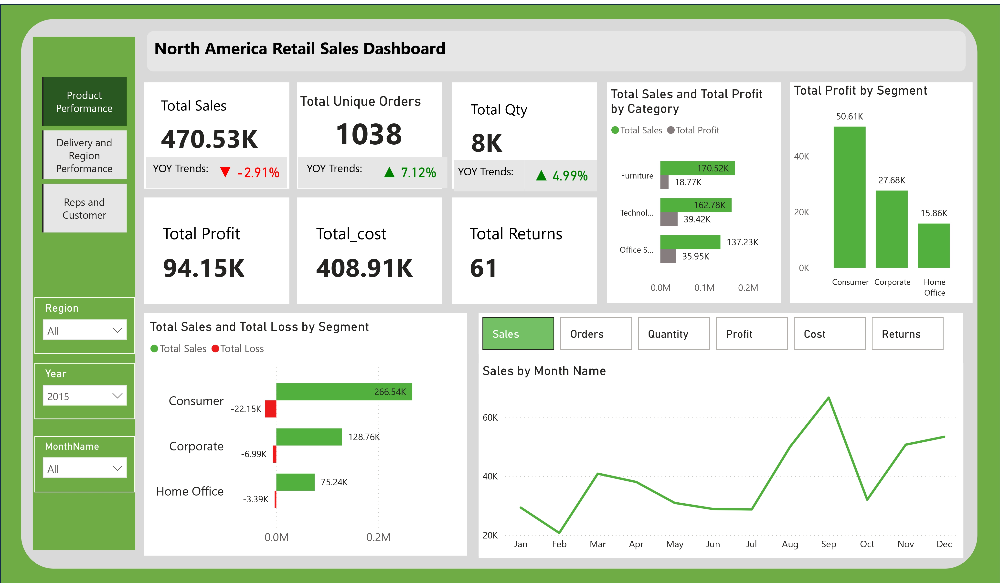
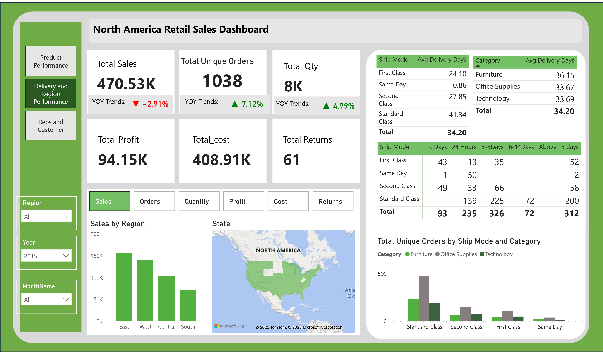
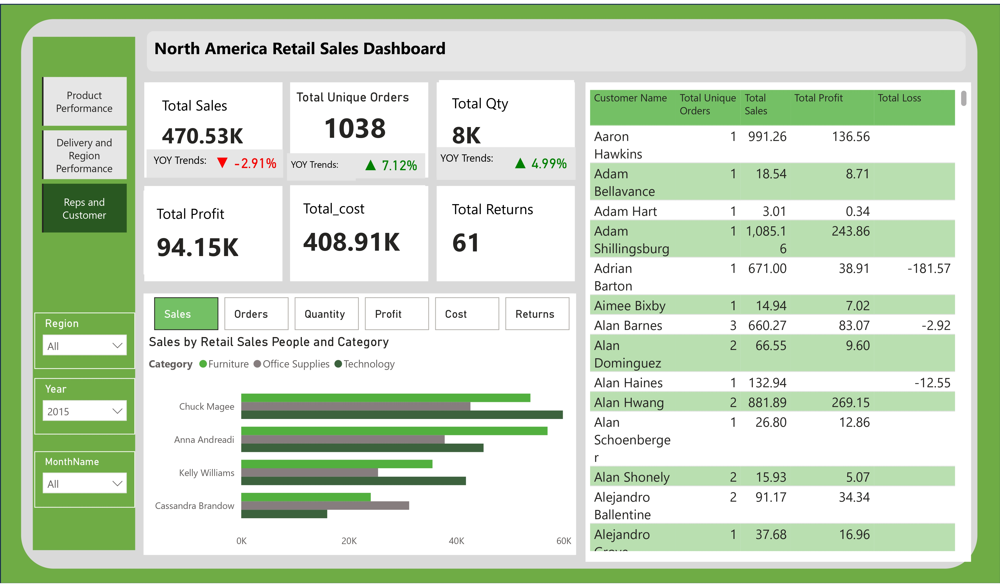

#  North America Sales Dashboard 

This project focuses on building a **Sales Performance Dashboard** for a retail company operating in **North America**. The dashboard provides insights into overall performance across different product categories, customer segments, shipping methods, and regions.

---

##  Objective

The goal of this project is to transform raw retail sales data into a **visually insightful and interactive Power BI dashboard** that helps business stakeholders answer key questions such as:

- How are sales performing over time?
- Which customer segments are driving profits or losses?
- What are the delivery trends across ship modes?
- Which product categories and regions are top performers?

## Tools Used

- **Power BI Desktop** – Data modeling, dashboard design, and storytelling
- **DAX** – For calculated columns, measures, and KPI logic

---

## 📊 Key Insights from the Dashboard

 Product Performance           |             Delivery and Region Perfomance      |                    Reps and Customer             
:------------------------------|-----------------------------------------------: |-----------------------------------------------:        
  |                     |                        

### 1. Orders are Up, but Sales are Down
- Total Unique Orders increased **+7.12% YoY**
- Total Sales declined **-2.91% YoY**

---

### 2. Consumer Segment Has Highest Sales—and Highest Loss
| Segment      | Sales     | Loss     |
|--------------|-----------|----------|
| Consumer     | $266.54K  | -$22.15K |
| Corporate    | $128.76K  | -$6.99K  |
| Home Office  | $75.24K   | -$3.39K  |

Profitability issues are concentrated in the **Consumer** segment.

---

### 3. Technology Category Delivers Highest Profit
| Category         | Sales     | Profit   |
|------------------|-----------|----------|
| Technology       | $160.2K   | $40K     |
| Office Supplies  | $135.8K   | $34K     |
| Furniture        | $174.5K   | $20K     |

---

### 4. Standard & Second Class Have Longest Delivery Times
| Ship Mode        | Avg Delivery Days |
|------------------|-------------------|
| Same Day         | 0.86 days         |
| First Class      | 24.10 days        |
| Second Class     | 27.85 days        |
| Standard Class   | 41.34 days        |

---

### 5.  East Region Outperforms All Others
- East leads in **total sales**
- West, Central, and South follow

---

##  Recommendations

1. **Boost Average Order Value**
   - Introduce bundles, upselling strategies, or incentives for higher cart sizes
   - Target frequent buyers with premium recommendations

2. **Investigate Consumer Segment Loss**
   - Audit high-selling products in Consumer segment for pricing or return issues
   - Re-evaluate discount structures or shipping costs for this segment

3. **Prioritize Technology for Growth**
   - Promote high-margin tech products more heavily in campaigns
   - Offer warranties, bundles, and exclusive deals to drive even more value

4. **Optimize Shipping Logistics**
   - Review Standard and Second Class fulfillment pipelines
   - Provide estimated delivery time transparency or switch customers to faster modes where possible

---

## 📊 Dashboard Link

Click the link below to explore the interactive Power BI dashboard:  
👉 [View Dashboard](https://app.powerbi.com/view?r=eyJrIjoiYzMyNDhkNjgtODk5My00MzA0LWJlNTUtZWUwYTYwNjUxNzJmIiwidCI6Ijk2MjdhZDVhLTIzOTgtNGM4Yi1iZTQ3LWM3OGFhYWMxNmE0MSJ9)

Have suggestions or questions?  
Feel free to open an issue or connect with me directly. I’d love to hear your thoughts and feedback.

You can also reach out to me on [LinkedIn](https://www.linkedin.com/in/elizabeth-oluwafemi-2b3b722b0/) if you'd like to connect
